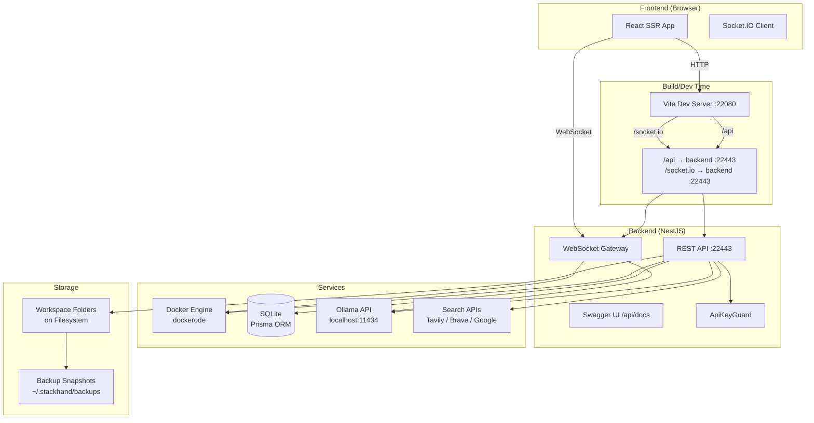
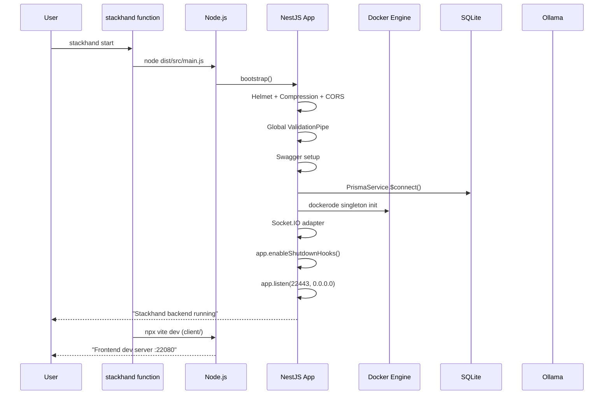
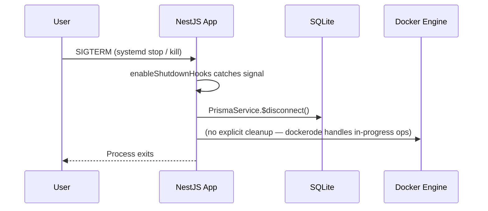

# Stackhand — Complete Architectural Audit

> **Document generated:** 2026-07-07  
> **Repository:** `/home/gautam-makwana/Workspace/stackhand`  
> **Audit type:** Static source-code analysis (no runtime inspection)  
> **Intended reader:** Senior DevOps architect performing a follow-up review

---

## 1. Project Overview

### Purpose
Stackhand is a **personal Docker/YAML stack manager** — a self-hosted web application that lets a single user manage Docker Compose stacks, containers, images, volumes, and Ollama-powered AI assistance from a browser-based UI.

### Overall Architecture
```
┌─────────────────────────────────────────────────────────────────────┐
│                        Browser (React SSR)                          │
│              TanStack Start / React Router / Socket.IO Client       │
└───────────────────────┬─────────────────────────────────────────────┘
                        │  HTTP / WS
                        ▼
┌─────────────────────────────────────────────────────────────────────┐
│                    Vite Dev Server (port 22080)                      │
│              Proxy: /api → backend, /socket.io → backend            │
└───────────────────────┬─────────────────────────────────────────────┘
                        │
          ┌─────────────┼─────────────┐
          ▼             ▼             ▼
┌─────────────────┐ ┌──────────┐ ┌──────────┐
│  NestJS Backend  │ │ Socket.IO│ │  Swagger │
│  (port 22443)    │ │ Gateway  │ │  /api/docs│
└────────┬────────┘ └──────────┘ └──────────┘
         │
         ├─── Docker Engine (dockerode)
         ├─── SQLite / Prisma ORM
         ├─── Ollama HTTP API (localhost:11434)
         └─── External Search APIs (Tavily, Brave, Google)
```

### Design Philosophy
- **Single-user by design** — Auth is a static bearer token, no user registry, no multi-tenancy
- **Local-first** — SQLite database, filesystem-based workspaces, local Docker Unix socket
- **Minimal dependencies** — Avoids Kubernetes, Redis, or external message brokers
- **AI-augmented** — Ollama integration for compose generation and general assistance
- **Workspace-oriented** — Isolated folders on disk, each with its own stacks, env files, and chat history

### Primary Use Cases
1. Browse and manage Docker Compose stacks via web UI
2. Create stacks from templates (Nginx, Redis, Postgres, MySQL, MongoDB)
3. Start/stop/restart stacks with one click
4. Edit YAML files with live preview and version history
5. Browse Docker containers, images, and volumes
6. Pull images from Docker Hub with progress streaming
7. Chat with local LLMs (Ollama) for Docker assistance
8. Browse and edit files in workspace folders
9. Backup and restore workspace snapshots

### Supported Operating Systems
Linux (de facto). The Docker socket path resolution includes macOS paths (`~/.docker/desktop/docker.sock`) for Linux Docker Desktop compatibility. Windows is not considered.

### Intended Users
- Single developer or hobbyist running Docker on a personal workstation or home server
- Solo operators who want a browser-based alternative to CLI `docker-compose`

### Current Maturity
**Prototype / Internal Tool** — version `0.0.1`. Functional end-to-end but lacks production hardening. Single commit author, no CI/CD, no automated tests beyond a single spec file.

---

## 2. Repository Structure

```
stackhand/
├── .agents/                          # OpenCode AI agent definitions
├── .codex/                           # Codex/OpenCode configuration
├── .env                              # Local environment variables (gitignored)
├── .env.example                      # Environment template
├── .gitignore
├── .prettierrc
├── AGENTS.md                         # Agent instructions (in client/)
├── README.md
├── ecosystem.config.cjs              # PM2 process manager config
├── eslint.config.mjs
├── nest-cli.json                     # NestJS CLI config
├── package.json                      # Root: backend + orchestration scripts
├── package-lock.json
├── prisma.config.ts                  # Prisma config (generated)
├── stackhand.service                 # systemd unit file
├── tsconfig.json                     # Backend TypeScript config
├── tsconfig.build.json               # Backend build config
├── .api.pid                          # Runtime: API process PID
├── .ui.pid                           # Runtime: UI process PID
├── stackhand-api.log                 # Runtime: API logs
├── stackhand-ui.log                  # Runtime: UI logs
│
├── client/                           # React SSR frontend (TanStack Start)
│   ├── package.json
│   ├── tsconfig.json
│   ├── vite.config.ts                # Vite + proxy config for dev
│   ├── .prettierrc
│   ├── .prettierignore
│   ├── AGENTS.md                     # Lovable.dev integration notice
│   ├── public/                       # Static assets
│   │   ├── docker.svg
│   │   ├── favicon.ico
│   │   └── robots.txt
│   ├── src/
│   │   ├── components/               # React components
│   │   │   ├── ui/                   # shadcn/ui components (45+ primitives)
│   │   │   ├── app-sidebar.tsx       # Main sidebar navigation
│   │   │   ├── yaml-editor.tsx       # CodeMirror-like YAML editor
│   │   │   ├── yaml-diff.tsx         # Side-by-side YAML diff
│   │   │   ├── yaml-history.tsx      # Version history timeline
│   │   │   ├── logs-viewer.tsx       # Live log streaming
│   │   │   ├── health-panel.tsx      # Container health checks
│   │   │   ├── resource-limits.tsx   # CPU/memory limit editor
│   │   │   ├── status-badge.tsx      # Status indicator
│   │   │   ├── status-bar.tsx        # Bottom status bar
│   │   │   ├── top-bar.tsx           # Top navigation bar
│   │   │   ├── theme-toggle.tsx      # Dark/light mode toggle
│   │   │   ├── workspace-switcher.tsx
│   │   │   ├── folder-picker.tsx     # Folder browser dialog
│   │   │   ├── onboarding-wizard.tsx # First-run setup wizard
│   │   │   ├── command-palette.tsx   # ⌘K command palette
│   │   │   ├── shortcuts-dialog.tsx  # Keyboard shortcuts help
│   │   │   ├── chat-input-tools.tsx  # AI chat toolbar
│   │   │   ├── loader.tsx            # Loading spinner
│   │   │   ├── page-skeleton.tsx     # Skeleton loader
│   │   │   └── empty-state.tsx       # Empty state placeholder
│   │   ├── hooks/
│   │   │   └── use-mobile.tsx        # Responsive hook
│   │   ├── lib/
│   │   │   ├── api.ts                # HTTP API client (all endpoints)
│   │   │   ├── types.ts              # TypeScript interfaces
│   │   │   ├── constants.ts          # Default settings
│   │   │   ├── workspace-store.tsx    # React context state store
│   │   │   ├── socket.ts             # Socket.IO client + React hook
│   │   │   ├── utils.ts              # Utility functions
│   │   │   ├── theme-provider.tsx     # Dark/light theme context
│   │   │   ├── icon-map.tsx           # Icon component registry
│   │   │   ├── sqlite.ts              # Client-side SQLite backup tracking
│   │   │   ├── error-capture.ts       # SSR error capture
│   │   │   ├── error-page.tsx         # Fallback error page
│   │   │   └── lovable-error-reporting.ts  # Lovable error reporting
│   │   ├── routes/                   # TanStack Router file-based routes
│   │   │   ├── __root.tsx            # Root layout with providers
│   │   │   ├── index.tsx             # Root redirect
│   │   │   ├── onboarding.tsx        # Setup wizard page
│   │   │   ├── _app.tsx              # Authenticated app layout
│   │   │   ├── _app.dashboard.tsx    # Overview dashboard
│   │   │   ├── _app.stacks.tsx       # Stack list + create
│   │   │   ├── _app.stacks.$stackId.tsx  # Stack detail
│   │   │   ├── _app.containers.tsx   # Container list
│   │   │   ├── _app.images.tsx       # Image list
│   │   │   ├── _app.volumes.tsx      # Volume list + file browser
│   │   │   ├── _app.yaml.tsx         # File explorer + YAML editor
│   │   │   ├── _app.env.tsx          # Env file manager
│   │   │   ├── _app.registry.tsx     # Docker Hub registry browser
│   │   │   ├── _app.ai.tsx           # AI Studio (Ollama chat)
│   │   │   ├── _app.alerts.tsx       # Alert rules
│   │   │   ├── _app.metrics.tsx      # Container metrics/charts
│   │   │   ├── _app.settings.tsx     # Workspace settings
│   │   │   ├── _app.setup.tsx        # Docker engine status
│   │   │   ├── sitemap[.]xml.ts      # SEO sitemap
│   │   │   └── README.md
│   │   ├── router.tsx                # Router factory
│   │   ├── routeTree.gen.ts          # Auto-generated route tree
│   │   ├── server.ts                 # SSR fetch handler
│   │   ├── start.ts                  # TanStack Start config
│   │   └── styles.css                # Tailwind CSS
│   ├── .output/                      # Build output (SSR server + assets)
│   ├── .tanstack/                    # Router cache
│   └── .wrangler/                    # Cloudflare deploy config
│
├── prisma/                           # Database schema & migrations
│   ├── schema.prisma                 # Full data model (16 models)
│   ├── seed.ts                       # Default workspace seed
│   ├── migrations/
│   │   ├── migration_lock.toml
│   │   ├── 20260703071603_init/      # Initial schema
│   │   ├── 20260706155700_add_ai_session/  # AI sessions
│   │   ├── 20260707064019_deploy/    # Deployment adjustments
│   │   └── 20260707070507_improved_backend/ # Backend improvements
│
├── scripts/
│   ├── install-service.sh            # systemd service installer
│   └── fix-service.sh                # Service fix script (hardcoded user)
│
├── src/                              # NestJS backend source
│   ├── main.ts                       # Entry point: bootstrap, CORS, Swagger, compression, helmet
│   ├── app.module.ts                 # Root module: imports all feature modules
│   ├── app.controller.ts             # Root GET /
│   ├── app.controller.spec.ts        # Unit test
│   ├── app.service.ts                # Root service
│   ├── health.controller.ts          # GET /api/health (public)
│   │
│   ├── auth/                         # Authentication
│   │   ├── auth.module.ts            # Global APP_GUARD registration
│   │   └── auth.guard.ts             # Bearer token guard (ApiKeyGuard)
│   │
│   ├── common/                       # Shared utilities
│   │   ├── common.module.ts
│   │   ├── docker-client.ts          # Dockerode singleton + socket resolution
│   │   ├── activity-logger.ts        # Audit trail writer
│   │   ├── http-exception.filter.ts  # Global exception filter
│   │   ├── request-logger.middleware.ts  # HTTP request logging
│   │   ├── resolve-path.ts           # Path traversal prevention
│   │   └── skip-auth.decorator.ts    # @Public() decorator
│   │
│   ├── prisma/                       # Database layer
│   │   ├── prisma.module.ts          # Global module
│   │   ├── prisma.service.ts         # PrismaClient wrapper
│   │   └── prisma-client.ts          # SQLite URL resolution + WAL mode
│   │
│   ├── workspace/                    # Workspace CRUD
│   ├── filesystem/                   # File/folder browser & YAML editing
│   ├── stack/                        # Docker Compose stack management
│   │   └── templates.ts              # 6 built-in compose templates
│   ├── container/                    # Docker container management
│   ├── image/                        # Docker image management
│   ├── volume/                       # Docker volume management
│   ├── registry/                     # Docker Hub registry API
│   ├── ollama/                       # Ollama AI integration
│   ├── ai-session/                   # AI session & message CRUD
│   ├── search/                       # Web search (Tavily/Brave/Google)
│   ├── dashboard/                    # Aggregated overview
│   ├── settings/                     # Global settings
│   ├── docker/                       # Docker engine info
│   ├── backup/                       # Workspace file backup & restore
│   ├── database/                     # Raw SQLite browser
│   └── gateway/                      # Socket.IO WebSocket gateway
│
├── dist/                             # Compiled backend output
├── generated/                        # Generated Prisma client
├── workspaces-data/                  # SQLite databases (gitignored)
├── node_modules/                     # Ignored
└── client/node_modules/              # Ignored
```

### Hidden Files
| File | Purpose |
|---|---|
| `.env` | Runtime configuration (gitignored) |
| `.env.example` | Configuration template |
| `.gitignore` | 62 patterns |
| `.prettierrc` | `singleQuote: true, trailingComma: all` |
| `.api.pid` | Runtime PID for `stackhand stop` |
| `.ui.pid` | Runtime PID for `stackhand stop` |
| `client/.prettierignore` | Frontend prettier exclusions |
| `client/.wrangler/` | Cloudflare deployment config |
| `client/.tanstack/` | TanStack Router cache |
| `stackhand.service` | systemd unit file |

---

## 3. Architecture

### High-Level Architecture



### Component Interactions

| Consumer | Provider | Protocol | Purpose |
|---|---|---|---|
| Frontend | NestJS API | HTTP REST | CRUD operations |
| Frontend | Socket.IO Gateway | WebSocket | Real-time logs, stats, pulls, AI |
| NestJS | Docker Engine | Unix socket (dockerode) | Container/stack/image management |
| NestJS | SQLite | Prisma ORM | Persistence |
| NestJS | Ollama | HTTP `localhost:11434` | AI chat/streaming |
| NestJS | Tavily/Brave/Google | HTTPS | Web search for AI context |
| Vite dev server | NestJS | HTTP proxy | Dev-mode CORS avoidance |

### Startup Workflow



### Shutdown Workflow


### Networking Model
- **Backend:** binds `0.0.0.0:PORT` (default 22443)
- **Frontend dev server:** binds `0.0.0.0:FRONTEND_PORT` (default 22080)
- **Frontend production:** served by NestJS `ServeStaticModule` from `client/.output/public/`
- **CORS:** dynamic origin validation — allows private/local hostnames by default, configurable via `CORS_ORIGIN`/`FRONTEND_ORIGIN`
- **Docker:** Unix socket only (`/var/run/docker.sock`, `~/.docker/desktop/docker.sock`, or rootless socket)
- No TCP Docker host support

### Container Lifecycle
```
User clicks "Start" ──→ POST /api/stacks/:id/up
                           │
                           ├── execComposeWithOutput("docker compose -f ... up -d")
                           ├── syncContainers() — lists Docker containers matching project name
                           ├── update DB: status = "running"
                           └── log activity

User clicks "Stop" ────→ POST /api/stacks/:id/down
                           │
                           ├── execComposeWithOutput("docker compose -f ... down")
                           ├── update DB: containers status = "stopped"
                           ├── update DB: stack status = "stopped"
                           └── log activity
```

### Image Lifecycle
```
Search Docker Hub ──→ GET /images/search?q=nginx
                          │
                          └── fetch("https://hub.docker.com/v2/search/repositories/...")

Pull image ────────→ POST /images/pull { name: "nginx" }
                          │
                          └── docker.pull(name, callback) + followProgress

Remove image ──────→ DELETE /images/:name
                          │
                          └── docker.getImage(name).remove()
```

### Volume Lifecycle
```
List volumes ──────→ GET /volumes
                         │
                         └── docker.listVolumes()

Remove volume ─────→ DELETE /volumes/:name
                         │
                         └── docker.getVolume(name).remove()

Prune volumes ─────→ POST /volumes/prune
                         │
                         └── docker.pruneVolumes()

Browse files ──────→ GET /volumes/:name/files?path=...
                         │
                         └── fs.readdirSync(mountpoint)
```

### Configuration Flow
```
.env file
    │
    ├── ConfigModule.forRoot({ isGlobal: true }) (NestJS)
    │       │
    │       ├── process.env.PORT, HOST, DATABASE_URL, etc.
    │       ├── AuthGuard reads STACKHAND_API_TOKEN
    │       ├── OllamaService reads OLLAMA_BASE_URL
    │       └── SearchService reads TAVILY_API_KEY, BRAVE_SEARCH_API_KEY, etc.
    │
    └── client/vite.config.ts reads .env directly
            │
            ├── VITE_STACKHAND_API_TOKEN (compiled into frontend bundle)
            ├── VITE_DEFAULT_WORKSPACE_ROOT
            └── Proxy target (backend origin)
```

### Environment Variable Flow
```mermaid
flowchart LR
    ENV[.env file] --> NESTJS[ConfigModule<br>isGlobal: true]
    ENV --> VITE[client/vite.config.ts<br>readRootEnv()]
    VITE --> DEFINE[import.meta.env<br>compile-time]
    NESTJS --> AUTH[AuthModule]
    NESTJS --> OLLAMA[OllamaService]
    NESTJS --> SEARCH[SearchService]
    DEFINE --> FRONTEND[React App]
    FRONTEND --> API[api.ts getApiBase()]
```

### Data Persistence Strategy

| Data Store | Location | Technology | Persistence |
|---|---|---|---|
| Workspace metadata | `DATABASE_URL` (default `~/.local/share/stackhand/workspaces-data/stackhand.db`) | SQLite via Prisma + better-sqlite3 | WAL mode, migrations |
| Stack YAML files | `{workspace.rootFolderPath}/{stackName}/docker-compose.yml` | Filesystem | Manual sync (no versioning on disk) |
| YAML version history | `YamlVersion` table in SQLite | Prisma | Automatic on every YAML save |
| AI chat sessions | `AiSession` + `AiMessage` tables | Prisma | Automatic |
| Environment files | `EnvFile` table in SQLite | Prisma | Imported manually |
| Activity log | `Activity` table in SQLite | Prisma | Automatic |
| Search logs | `SearchLog` table in SQLite | Prisma | Automatic on every search |
| Backups | `~/.stackhand/backups/{workspaceName}/snapshot-{ts}/` | Filesystem copy | Triggered manually |
| Settings | `Setting` table (JSON blob) | Prisma | Updated via API |
| Client state | `localStorage stackhand-state-v2` | Browser storage | JSON blob (chats, alerts, snippets, density) |
| API token | `localStorage stackhand-api-token` | Browser storage | Plain text |

---

## 4. Docker Compose System

### Compose Files
There are no static `compose.yaml` files in the repository. Every compose file is:
1. **Created dynamically** — via the "New stack" wizard or AI generation
2. **Stored on the filesystem** — `{workspaceRoot}/{folderName}/docker-compose.yml`
3. **Managed via `docker compose` CLI** — spawned as a child process, not through the Compose Go API

### Compose Operations
All compose commands are executed by spawning a child process:
```typescript
spawn('docker', ['compose', '-f', composeFile, cmd, ...args], { cwd: folderPath })
```

Commands used:
- `docker compose -f <file> up -d`
- `docker compose -f <file> down`
- `docker compose -f <file> logs --tail N`
- `docker compose -f <file> restart` (implemented as down + up -d)

### No Compose Features Used
- No compose profiles
- No YAML extensions (`x-` anchors)
- No service inheritance
- No compose override files
- No health check definitions in compose output parsing

### Dependency Graph
No explicit dependency tracking between stacks. The `compose up -d` command relies on Docker Compose's own dependency resolution within a single compose file.

### Startup Ordering
- Backend starts first, then the frontend dev server
- No health check before frontend proxy starts forwarding
- The production systemd service only runs the backend; frontend is separate

### Health Checks
- **Backend API:** `GET /api/health` returns `{ status: "ok", timestamp }`
- **Docker engine:** `GET /api/docker/ping` returns `{ alive: boolean }`
- No container health check integration in the stack detail view (the `HealthPanel` component exists but the backend lacks health check data)

### Service Communication
- Frontend ↔ Backend: HTTP REST + Socket.IO WebSocket
- Backend ↔ Docker: Unix socket via dockerode
- Backend ↔ Ollama: direct HTTP to `localhost:11434`
- Backend ↔ Search APIs: HTTPS to external services

---

## 5. Docker Images

There are **no custom Docker images** in this project. The project runs directly on Node.js (no containerization of Stackhand itself).

### Docker Images Managed by Stackhand

| Image | Purpose | Source | Version Strategy |
|---|---|---|---|
| nginx:alpine | Static files / reverse proxy | Docker Hub official | Hardcoded in template |
| redis:7-alpine | In-memory data store | Docker Hub official | Hardcoded in template |
| postgres:16 | SQL database | Docker Hub official | Hardcoded in template |
| mysql:8 | SQL database | Docker Hub official | Hardcoded in template |
| mongo:7 | Document database | Docker Hub official | Hardcoded in template |

All images are pulled via the Docker Hub API v2. Pull policy is manual (user-initiated via UI).

### Build Strategy
No custom Dockerfiles. Stackhand manages pre-built images only.

### Caching
Docker layer caching is handled entirely by the Docker daemon. Stackhand does not implement its own image cache.

---

## 6. Networking

### Docker Networks
Stackhand does not create or manage Docker networks directly. It relies on Docker Compose's default network creation (one bridge network per compose project).

### No Custom Networks
- No overlay networks
- No macvlan/ipvlan
- No network aliases configured by Stackhand
- The compose generator in the UI has an "Advanced" tab with a "Network name" field, but the backend does not enforce any network policies

### Ports

| Service | Default Port | Configurable | Exposed |
|---|---|---|---|
| NestJS Backend | 22443 | `PORT` env | `0.0.0.0` (all interfaces) |
| Vite Dev Server (dev) | 22080 | `FRONTEND_PORT` env | `0.0.0.0` (all interfaces) |
| Swagger UI | 22443 | Same as backend | `0.0.0.0` |
| Socket.IO | 22443 | Same as backend | Via HTTP server |

### Host Mappings
- Backend binds to `0.0.0.0` by default
- No TLS/SSL anywhere
- No reverse proxy configuration included (but hinted at — the CORS config allows specifying origins)

### Internal Networking
```
localhost:11434  →  Ollama API
/var/run/docker.sock  →  Docker Engine
```

### External Access
- Docker Hub API v2 (`hub.docker.com`) for image search
- Tavily API (`api.tavily.com`) for web search
- Brave Search API (`api.search.brave.com`) for web search
- Google Custom Search API (`www.googleapis.com`) for web search

---

## 7. Volumes

### Named Volumes
Managed through Docker's volume API via dockerode:
- `docker.listVolumes()` — list all volumes
- `docker.getVolume(name).inspect()` — inspect a volume
- `docker.getVolume(name).remove()` — delete a volume
- `docker.pruneVolumes()` — remove unused volumes

### Bind Mounts
Stackhand does not manage bind mounts. Compose files created by users may include bind mounts.

### Temporary Volumes
No explicit tmpfs mounts. Docker Compose may create anonymous volumes during `up`.

### Backup Strategy
Two backup systems exist:

**1. File-level snapshots** (`src/backup/backup.service.ts`):
- Copies workspace folder to `~/.stackhand/backups/{workspaceName}/snapshot-{timestamp}/`
- Excludes `.git` and `node_modules`
- Can list, restore, and delete snapshots
- No compression, no deduplication

**2. Client state export** (`workspace-store.tsx`):
- JSON export of chat history, alerts, snippets, env files, density
- Downloaded as a .json file
- Importable via settings page

### Restore Strategy
- File-level: copies snapshot files back to workspace root
- Client state: parses JSON and overwrites localStorage

### Migration Strategy
No migration tooling exists. The SQLite database can be copied manually. The `.env` file points to the database location.

---

## 8. Configuration System

### .env Files

| Variable | Default | Purpose |
|---|---|---|
| `STACKHAND_API_TOKEN` | (required) | Bearer token for API auth |
| `PORT` | `22443` | Backend port |
| `FRONTEND_PORT` | `22080` | Frontend dev server port |
| `HOST` | `0.0.0.0` | Backend bind host |
| `DEFAULT_WORKSPACE_ROOT` | (none) | Seed script workspace path |
| `OLLAMA_BASE_URL` | `http://localhost:11434` | Ollama API endpoint |
| `DATABASE_URL` | `file:./workspaces-data/stackhand.db` | SQLite path |
| `TAVILY_API_KEY` | (none) | Web search provider |
| `BRAVE_SEARCH_API_KEY` | (none) | Web search fallback |
| `GOOGLE_API_KEY` | (none) | Web search fallback |
| `GOOGLE_CX` | (none) | Google Custom Search engine ID |

### Environment Loading
1. NestJS: `@nestjs/config` (`ConfigModule.forRoot({ isGlobal: true })`) — loads `.env` from project root
2. Frontend dev: `client/vite.config.ts` reads `.env` directly via `readRootEnv()` and injects into `import.meta.env`
3. Prisma: `prisma.config.ts` uses `dotenv/config` to load `.env`

### Secrets
- API token is stored in `.env` and in `localStorage` on the client
- Search API keys are in `.env` (committed to git in this case — security concern)
- Ollama endpoint is not authenticated
- No encryption at rest for any secrets

### Configuration Hierarchy
```
1. Environment variables (process.env / import.meta.env)
2. .env file
3. Hardcoded defaults in code
```

### Validation
- NestJS `ValidationPipe` with `whitelist: true`, `forbidNonWhitelisted: true` — validates request DTOs
- Path traversal prevention via `resolveSafePath()` in `resolve-path.ts`
- YAML validation via `yaml.load()` on write
- SQL injection prevention via table/column name regex validation in `database.service.ts`
- No configuration validation at startup (missing `STACKHAND_API_TOKEN` would silently use `"dev-token"`)

---

## 9. Middleware / Engine

### Docker Engine Wrapper (`docker-client.ts`)

```mermaid
flowchart LR
    APP[Application Logic] --> GET[getDockerClient()]
    GET --> RESOLVE[resolveDockerSocket]
    RESOLVE --> CACHE{cachedClient?}
    CACHE -->|yes| RETURN[return cachedClient]
    CACHE -->|no| SOCKET_PATH
    SOCKET_PATH --> CANDIDATES[Check socket paths]
    CANDIDATES -->|found| CREATE[new Dockerode(socketPath)]
    CANDIDATES -->|not found| CREATE_DEFAULT[new Dockerode()]
    CREATE --> CACHE_AND_RETURN
    CREATE_DEFAULT --> CACHE_AND_RETURN
```

Key characteristics:
- Singleton pattern with caching
- Supports three socket paths: Docker Desktop (`~/.docker/desktop/docker.sock`), rootless (`/run/user/$UID/docker.sock`), and default (`/var/run/docker.sock`)
- No fallback to TCP (no `DOCKER_HOST` support)
- `resetDockerClient()` clears the cache (not currently called anywhere in the codebase)

### Service Discovery
No service discovery mechanism exists. All services have hardcoded addresses:
- Docker: Unix socket (auto-detected)
- Ollama: `http://localhost:11434` (configurable)
- Search APIs: hardcoded URLs

### Project Detection
Docker Compose project name is derived from the folder basename (lowercased). Container matching uses the `com.docker.compose.project` label.

### YAML Loading
- `js-yaml` library for parsing and dumping
- Validation occurs on every file write and stack creation
- AI-generated YAML is parsed by extracting JSON from LLM output or markdown code blocks

### Lifecycle Management
- Stack: `create → compose up → compose down → delete`
- Container: `create → start → stop → restart → remove`
- Workspace: `create → update → delete` (with optional folder deletion)

### Logging
- `RequestLoggerMiddleware` — logs HTTP method, URL, status code, duration
- `console.log` / `console.error` throughout (no structured logging)
- Winston/Pino/Bunyan are not used
- systemd `journald` captures stdout/stderr in production

### Monitoring
No built-in monitoring:
- Dashboard caches data for 5 seconds
- Container stats polled every 3 seconds via WebSocket
- No metrics exports (Prometheus, OpenTelemetry, etc.)
- No health check on the Socket.IO connection

### Orchestration
No orchestration layer. Stackhand manages a single Docker host. Features like multi-host, swarm, or Kubernetes are not supported.

---

## 10. Features

### Feature Matrix

| # | Feature | How It Works |
|---|---|---|
| 1 | **Workspace management** | CRUD via Prisma. Each workspace has a `rootFolderPath` pointing to a directory on disk. Creating a workspace optionally creates the directory. |
| 2 | **Stack creation** | User fills a form with service name, image, ports, env vars, volumes. YAML is generated client-side via `buildYaml()`. POST to backend creates the folder, validates YAML, writes the file, creates a DB record. |
| 3 | **Template-based stacks** | 6 built-in templates (Nginx, Redis, Postgres, MySQL, MongoDB, Blank) stored in `src/stack/templates.ts`. Template parameters use `{{variable}}` syntax with simple string replacement. |
| 4 | **One-click deploy** | `POST /api/stacks/:id/up` spawns `docker compose -f ... up -d`. Output is returned as HTTP response (not streamed by default). |
| 5 | **Real-time compose logs** | WebSocket event `stack:compose-progress` subscribes to `docker compose` output via spawned child process. Output is streamed line-by-line. |
| 6 | **Container management** | Via dockerode: list, inspect, start, stop, restart, remove. No container creation UI beyond the simple "Run Container" dialog. |
| 7 | **Container stats** | Real-time CPU/memory stats via `container.stats({ stream: false })`. Polled every 3 seconds via WebSocket. |
| 8 | **Image management** | List local images, pull from Docker Hub (with progress streaming via WebSocket), remove images. Search via Docker Hub API v2. |
| 9 | **Image registry browser** | Full Docker Hub search, repository details, tag listing, pull with SSE progress streaming. Popular sections and favorites. |
| 10 | **Volume management** | List, inspect, remove, prune volumes. Browse and read files within volume mountpoints directly. |
| 11 | **YAML editor** | Textarea-based editor with live preview. YAML validated on save. |
| 12 | **YAML version history** | Every YAML save creates a `YamlVersion` record. History tab allows reverting to any previous version. |
| 13 | **YAML diff** | Side-by-side comparison between running YAML and edited YAML. |
| 14 | **File explorer** | Recursive tree view of workspace folders. Supports create, rename, delete, duplicate of files and folders. |
| 15 | **Env file manager** | Import/export `.env` files. Per-variable secret masking. Per-directory env isolation. |
| 16 | **Backup & restore** | Filesystem snapshots copied to `~/.stackhand/backups/`. List, restore, and delete snapshots. |
| 17 | **Client state export/import** | JSON export of chat history, alerts, snippets. Download and re-import. |
| 18 | **AI Studio (Ollama)** | Chat interface to local LLMs. Streaming tokens via SSE. Configurable generation parameters (temperature, top_p, top_k, etc.). |
| 19 | **AI compose generation** | `POST /ollama/generate-stack` — sends natural language description to Ollama, parses JSON/markdown response for compose YAML. |
| 20 | **Web search for AI** | Built-in web search (Tavily, Brave, Google) that injects search results as context into AI prompts. |
| 21 | **AI session management** | Persistent chat sessions with history stored in SQLite. Multi-session sidebar with rename/delete. |
| 22 | **Alert rules** | UI for creating alert rules (CPU > 80%, memory > 80%, restart count > 3, downtime > 5m). Rules are stored locally only — no backend enforcement. |
| 23 | **Dashboard** | Aggregated view: stack counts, container counts, recent activity, disk usage, CPU/memory charts. Polls every 10 seconds. |
| 24 | **Metrics page** | CPU, memory, and network I/O charts with time ranges (1h, 24h, 7d, Live). Live mode polls every 5 seconds. |
| 25 | **Command palette** | ⌘K search for quick navigation. |
| 26 | **Theme toggle** | Light, dark, and system theme. |
| 27 | **Density toggle** | Comfortable / compact layout modes. |
| 28 | **Database browser** | Raw SQLite table viewer. List tables, view schema, browse rows, execute raw SQL. |
| 29 | **Onboarding wizard** | First-run setup: create initial workspace, configure root folder. |
| 30 | **systemd service** | Auto-restart, production deployment via systemd. |
| 31 | **PM2 support** | `ecosystem.config.cjs` for PM2 cluster mode deployment. |
| 32 | **Shell function** | `stackhand` bash function for start/stop/restart/build/logs from CLI. |
| 33 | **Swagger docs** | Auto-generated OpenAPI documentation at `/api/docs`. |

---

## 11. API

### Base URL
- Dev: `http://localhost:4000/api`
- Production: `http://localhost:22443/api`

### Authentication
All endpoints require `Authorization: Bearer <STACKHAND_API_TOKEN>` header, except:
- `GET /api/health` — public

### Endpoints

| Method | Path | Purpose |
|---|---|---|
| `GET` | `/api/health` | Health check (public) |
| `GET` | `/api/workspaces` | List workspaces |
| `POST` | `/api/workspaces` | Create workspace |
| `GET` | `/api/workspaces/:id` | Get workspace |
| `PATCH` | `/api/workspaces/:id` | Update workspace |
| `DELETE` | `/api/workspaces/:id` | Delete workspace |
| `POST` | `/api/workspaces/validate-path` | Check path accessibility |
| `POST` | `/api/workspaces/:wid/backup` | Backup workspace |
| `GET` | `/api/workspaces/:wid/backups` | List backups |
| `POST` | `/api/workspaces/:wid/backups/:snap/restore` | Restore backup |
| `DELETE` | `/api/workspaces/:wid/backups/:snap` | Delete backup |
| `POST` | `/api/filesystem/browse` | Browse folder |
| `POST` | `/api/filesystem/tree` | Recursive file tree |
| `POST` | `/api/filesystem/read` | Read file |
| `POST` | `/api/filesystem/write` | Write file (with YAML validation) |
| `POST` | `/api/filesystem/create-folder` | Create folder |
| `POST` | `/api/filesystem/rename` | Rename file/folder |
| `POST` | `/api/filesystem/delete` | Delete file/folder |
| `POST` | `/api/filesystem/duplicate` | Duplicate file |
| `GET` | `/api/workspaces/:wid/stacks` | List stacks |
| `POST` | `/api/workspaces/:wid/stacks` | Create stack |
| `GET` | `/api/stacks/:id` | Get stack detail |
| `PUT` | `/api/stacks/:id/yaml` | Update YAML |
| `DELETE` | `/api/stacks/:id` | Delete stack |
| `POST` | `/api/stacks/:id/up` | docker compose up |
| `POST` | `/api/stacks/:id/down` | docker compose down |
| `POST` | `/api/stacks/:id/restart` | docker compose restart |
| `GET` | `/api/stacks/:id/logs` | Get stack logs |
| `GET` | `/api/stack-templates` | List templates |
| `POST` | `/api/stack-templates/:id/generate` | Generate from template |
| `GET` | `/api/containers` | List containers |
| `GET` | `/api/containers/:id` | Inspect container |
| `POST` | `/api/containers` | Create & start container |
| `POST` | `/api/containers/:id/start` | Start container |
| `POST` | `/api/containers/:id/stop` | Stop container |
| `POST` | `/api/containers/:id/restart` | Restart container |
| `DELETE` | `/api/containers/:id` | Remove container |
| `GET` | `/api/containers/:id/stats` | Container stats |
| `GET` | `/api/containers/:id/logs` | Container logs |
| `GET` | `/api/images` | List local images |
| `GET` | `/api/images/search?q=` | Search Docker Hub |
| `GET` | `/api/images/tags/:ns/:name` | Get image tags |
| `POST` | `/api/images/pull` | Pull image |
| `DELETE` | `/api/images/:name` | Remove image |
| `GET` | `/api/volumes` | List volumes |
| `GET` | `/api/volumes/:name` | Inspect volume |
| `DELETE` | `/api/volumes/:name` | Remove volume |
| `POST` | `/api/volumes/prune` | Prune volumes |
| `GET` | `/api/volumes/:name/files` | Browse volume files |
| `GET` | `/api/volumes/:name/files/read` | Read volume file |
| `GET` | `/api/volumes/:name/usage` | Volume disk usage |
| `GET` | `/api/registry/search` | Docker Hub search |
| `GET` | `/api/registry/repository/:ns/:repo` | Repository details |
| `GET` | `/api/registry/repository/:ns/:repo/tags` | Repository tags |
| `POST` | `/api/registry/pull` | Pull image |
| `GET` | `/api/registry/pull-stream?sse` | Pull with SSE progress |
| `POST` | `/api/registry/generate-compose` | Generate compose from image |
| `POST` | `/api/registry/save-workspace` | Save compose to workspace |
| `GET` | `/api/registry/popular` | Popular images |
| `GET` | `/api/ollama/status` | Ollama connection status |
| `GET` | `/api/ollama/version` | Ollama version |
| `GET` | `/api/ollama/models` | List Ollama models |
| `GET` | `/api/ollama/model/:name` | Model info |
| `POST` | `/api/ollama/chat` | Chat (non-streaming) |
| `POST` | `/api/ollama/chat/stream` | Chat (SSE streaming) |
| `POST` | `/api/ollama/pull` | Pull Ollama model |
| `DELETE` | `/api/ollama/model/:name` | Delete model |
| `POST` | `/api/ollama/generate-stack` | AI compose generation |
| `GET` | `/api/ai-sessions?workspaceId=` | List AI sessions |
| `POST` | `/api/ai-sessions` | Create AI session |
| `GET` | `/api/ai-sessions/:id` | Get session with messages |
| `PATCH` | `/api/ai-sessions/:id` | Update session |
| `DELETE` | `/api/ai-sessions/:id` | Delete session |
| `POST` | `/api/ai-sessions/:id/messages` | Add message |
| `PATCH` | `/api/ai-sessions/:id/messages/:msgId` | Update message |
| `DELETE` | `/api/ai-sessions/:id/messages/:msgId` | Delete message |
| `GET` | `/api/search/status` | Search engine status |
| `GET` | `/api/search/logs` | Search history |
| `DELETE` | `/api/search/logs/:id` | Delete search log |
| `POST` | `/api/search/web` | Web search |
| `GET` | `/api/dashboard` | Aggregated overview |
| `GET` `/PUT` | `/api/settings` | Global settings |
| `GET` | `/api/docker/status` | Docker engine status |
| `GET` | `/api/docker/ping` | Docker ping |
| `GET` | `/api/db/tables` | List database tables |
| `GET` | `/api/db/:table/schema` | Table schema |
| `GET` | `/api/db/:table/rows` | Browse rows |
| `GET` `/POST` `/PUT` `/DELETE` | `/api/db/:table/rows/...` | Row CRUD |
| `POST` | `/api/db/query` | Execute raw SQL |
| `GET` | `/api/docs` | Swagger UI |

### Request Flow
```
Client → fetch() → Vite proxy → NestJS → AuthGuard → Controller → Service → Docker/Prisma/Ollama
```

### Response Flow
```
Docker/Prisma/Ollama → Service → Controller → JSON response → Client
```

For streaming:
```
Ollama SSE → OllamaController → Response (text/event-stream) → Client
Docker pull SSE → RegistryController → EventSource → Client
WebSocket → StackGateway → Socket.IO → Client
```

### Authentication Flow
```
Request → AllExceptionsFilter → ApiKeyGuard → Reflector (isPublic?) → 
    ├── Public → pass
    └── Protected → check Authorization: Bearer <token> → 
        ├── match → pass
        └── mismatch → 401 Unauthorized
```

### Permissions
No role-based access control. The single bearer token grants full access to all API endpoints.

---

## 12. CLI

There is no separate CLI binary. The primary user interaction is:

### Shell Function (`stackhand` in README.md)

| Command | Description |
|---|---|
| `stackhand start` | Build if needed, start backend + frontend as background processes |
| `stackhand stop` | Kill both processes by PID file |
| `stackhand restart` | Stop + 1s sleep + start |
| `stackhand build` | `npm run build` (backend + frontend) |
| `stackhand logs [api\|ui]` | Tail log files |

### npm Scripts

| Script | Description |
|---|---|
| `npm run setup` | Full setup: install deps, generate Prisma, run migrations, seed |
| `npm run dev` | Kill ports + DB sync + concurrent backend+frontend |
| `npm run dev:backend` | Backend watch mode only |
| `npm run dev:frontend` | Frontend dev server only |
| `npm run build` | Build backend + frontend |
| `npm run start:prod` | Serve compiled backend |
| `npm run prod` | Build + kill ports + concurrent backend+frontend |
| `npm run prisma:seed` | Seed default workspace |
| `npm run lint` | ESLint |
| `npm run test` | Jest |

### systemd Service

| Command | Description |
|---|---|
| `sudo systemctl start stackhand` | Start production backend |
| `sudo systemctl stop stackhand` | Stop |
| `sudo systemctl restart stackhand` | Restart |
| `sudo journalctl -u stackhand -f` | View logs |

### PM2 (Alternative)

| Command | Description |
|---|---|
| `pm2 start ecosystem.config.cjs` | Cluster mode with `max` instances |

---

## 13. UI

### Navigation
```
Sidebar:
├── Dashboard      /dashboard
├── Stacks         /stacks
├── Containers     /containers
├── Images         /images
├── Volumes        /volumes
├── Registry       /registry
├── AI Studio      /ai
├── Alerts         /alerts
├── Metrics        /metrics
├── Explorer       /yaml
├── Env Files      /env
├── Settings       /settings
├── Setup          /setup

Top Bar:
├── Workspace switcher
├── Command palette (⌘K)
├── Theme toggle
└── Notification area

Status Bar (bottom):
├── Docker engine status
├── Container count
└── Stack count
```

### Pages

| Page | Key Components | Data Source |
|---|---|---|
| **Dashboard** | Stat cards, line chart, bar chart, activity feed | `GET /api/dashboard` + polling `GET /api/containers`, `GET /api/images`, `GET /api/docker/status` |
| **Stacks** | Table with filters, create dialog, logs sheet, delete confirm | `workspace-store` (client state) + API |
| **Stack Detail** | Containers tab, YAML editor, diff view, health panel, limits editor, history | `GET /api/stacks/:id` |
| **Containers** | Table with 5s polling, start/stop/restart/remove, logs sheet | `GET /api/containers` |
| **Images** | Table, run container dialog, remove confirm | `GET /api/images` |
| **Volumes** | Table, inline file browser, file preview, prune dialog | `GET /api/volumes` + mountpoint FS access |
| **Registry** | Search with debounce, popular sections, favorites, details sheet, pull progress, compose generation | Docker Hub API via backend proxy |
| **AI Studio** | Chat sidebar, message bubbles, streaming composer, model selector, generation params, web search toggle | Ollama API via backend |
| **Alerts** | Rule list, create dialog, test button, enable/disable toggles | Client-side only (localStorage) |
| **Metrics** | Time range selector, CPU/mem/net area charts, live mode | `GET /api/containers` + `GET /api/containers/:id/stats` |
| **Explorer** | Recursive file tree, YAML editor, env editor, backup/restore | Filesystem API |
| **Env Files** | Import dialog, editable env cards with secret masking | Client-side (localStorage) + API |
| **Settings** | Workspace config, theme picker, Ollama models, density, backup/restore | Mixed (API + localStorage) |
| **Setup** | Docker engine status cards, connection details | `GET /api/docker/status` |

### State Management
- **React Context** (`WorkspaceProvider`) — global store holding workspaces, stacks, file trees, chats, alerts, snippets, env files, YAML history
- **localStorage** — persistence of client-side state (chats, alerts, sessions, density, API token)
- **Prisma/SQLite** — server-side persistence

### Workflows
```
Create Stack:
    Dialog → Select template → Configure form → Live YAML preview → POST → 
    Backend creates folder + writes file + DB record → Client adds to workspace store

Push to Production:
    npm run build → node dist/src/main.js (backend)
    npm run build:frontend → ServeStaticModule serves built frontend
```

---

## 14. Security

### Secret Handling
- `STACKHAND_API_TOKEN` stored in `.env` file (plaintext)
- Search API keys in `.env` (committed to git in this instance)
- Client stores API token in `localStorage` (plaintext)
- `.env` is gitignored, but API keys were committed in this repo
- Env file editor supports "secret" masking in UI (client-side only)

### Permissions
- Single static bearer token
- No user accounts, no roles, no RBAC
- No session management, no JWT, no OAuth

### Docker Socket Usage
- Read/write access to Docker Unix socket
- Full Docker daemon control (create/remove containers, images, volumes)
- Socket path auto-detection with multiple candidates
- No read-only mode, no restricted operations

### Privileged Containers
- Stackhand itself runs as a regular Node.js process
- However, it can deploy privileged containers via compose files

### Root/Rootless Support
- Socket path includes rootless Docker socket (`/run/user/$UID/docker.sock`)
- But the install script and systemd service assume root access (`sudo` required)

### Image Verification
- No image signature verification
- No vulnerability scanning
- No image pinning (uses mutable tags like `:latest`, `:alpine`, `:16`)

### Container Isolation
- Relies entirely on Docker's default security model
- No additional seccomp, AppArmor, or SELinux policies applied
- No container resource limits enforced by Stackhand

### Web Security
- Helmet middleware (CSP disabled, cross-origin embedder policy disabled)
- CORS restricted to private/local hostnames by default
- No TLS/HTTPS
- No CSRF protection
- No rate limiting
- No request size limiting

---

## 15. Performance

### Startup Speed
- **Backend:** ~2-3 seconds (NestJS DI + Prisma connection + Dockerode init)
- **Frontend dev:** ~5-10 seconds (Vite + TanStack Start SSR)
- **First load:** ~1-2 seconds (SSR renders initial page)

### Memory Usage
- **Backend process:** ~80-150 MB (Node.js + Prisma + Socket.IO)
- **Frontend dev server:** ~100-200 MB (Vite + Nitro SSR)
- **SQLite:** minimal (entire DB loaded on queries)

### CPU Usage
- Idle: minimal (<1% CPU)
- Container stats polling: 3s interval per container
- Dashboard polling: 10s interval
- Container list polling: 5s interval
- No CPU-intensive operations on the backend

### Parallelism
- Backend is single-threaded (Node.js event loop)
- PM2 cluster mode available but untested
- Concurrent requests use async I/O (non-blocking)
- SQLite is single-writer (better-sqlite3 is synchronous)

### Lazy Loading
- Frontend routes are code-split by TanStack Router
- No lazy loading on the backend
- Docker client is initialized on first call (not on startup)

### Caching
| Cache | Location | TTL | Invalidation |
|---|---|---|---|
| Dashboard overview | In-memory variable | 5 seconds | Time-based |
| Docker client | In-memory singleton | Process lifetime | Manual reset (never called) |
| Web search results | In-memory Map | 5 minutes | Time-based |

---

## 16. Logging

### Logging Architecture
- **Request logging:** `RequestLoggerMiddleware` logs every HTTP request: `[http] METHOD /path -> STATUS DURATIONms`
- **Application logging:** `console.log` / `console.error` throughout the codebase
- **No structured logging:** No JSON logs, no log levels, no correlation IDs
- **Socket.IO events:** `console.log("[socket] connected")`, `console.error("[socket] error", msg)`

### Log Storage
- **Development:** stdout/stderr (captured by terminal)
- **Production (shell function):** `stackhand-api.log` and `stackhand-ui.log`
- **Production (systemd):** `journalctl -u stackhand`
- **PM2:** `stackhand-api.log` (merged)

### Log Rotation
No log rotation is configured. The `stackhand-api.log` and `stackhand-ui.log` files grow unbounded.

### Debugging Tools
- **Swagger UI** at `/api/docs` for API testing
- **Database browser** at `/db` for inspecting SQLite
- **Docker status** at `/setup` for engine info
- No debug mode, no verbose logging toggle

### Tracing
No distributed tracing. No OpenTelemetry, Jaeger, or Zipkin integration.

---

## 17. Error Handling

### Validation
- NestJS `ValidationPipe` with whitelist/transform on all DTOs
- Path traversal protection via `resolveSafePath()`
- YAML validation before writes
- SQL injection protection via table name regex
- Generic `catch {}` blocks throughout (silent swallowing)

### Recovery
- Dashboard fails silently (returns cached/empty data)
- Socket.IO reconnects automatically (2s delay)
- Prisma client reconnects on connection loss
- Docker operations throw errors that propagate to HTTP 500

### Retries
- No retry logic for any operation
- `execComposeWithOutput` rejects on non-zero exit with no retry
- UI buttons remain disabled during operations (manual retry)

### Rollback
- YAML version history allows reverting to previous versions
- Stack restart is implemented as down + up (not a true rollback)
- No container-level rollback for failed deployments

### Failure Scenarios

| Scenario | Behavior |
|---|---|
| Docker daemon not running | API returns 500, UI shows error toast |
| Docker socket not found | `dockerode` throws, API returns 500 |
| SQLite file missing | Prisma throws, application crashes on startup |
| Ollama not running | Status returns `{ connected: false }`, AI features disabled |
| Invalid YAML | Validation error returned as 400 |
| Port already in use | Docker Compose fails, error displayed in UI |
| Workspace folder deleted | Stack becomes "unknown" status, operations fail with 404 |
| Network timeout (Docker Hub) | Search fails, error shown |
| Concurrent compose operations | No locking — race conditions possible |
| Prisma migration missing | Application crashes on startup |

---

## 18. Current Limitations

### Architectural Limitations

1. **Single-user only** — The API uses a single static bearer token. There is no concept of users, sessions, or multi-tenancy.

2. **Single Docker host** — All operations target the local Docker socket. No support for remote Docker hosts, Docker Swarm, or Kubernetes.

3. **No containerization of Stackhand** — The application runs directly on Node.js. There is no Dockerfile or container image for Stackhand itself.

4. **No process supervision for frontend** — In production, only the backend is managed by systemd. The frontend requires a separate process manager.

5. **SQLite concurrency** — better-sqlite3 is synchronous and single-writer. Multiple concurrent write operations will queue.

### Technical Debt

6. **API keys committed to git** — `.env` contains live API keys for Tavily and Google that were committed to the repository.

7. **Secrets in client bundle** — `STACKHAND_API_TOKEN` is compiled into the frontend JavaScript bundle via Vite `define`.

8. **Hardcoded user in scripts** — `scripts/fix-service.sh` has the user `gautam-makwana` hardcoded.

9. **Toast error patterns** — The frontend uses a repetitive try/catch/toast.error pattern across all pages (DRY violation).

10. **Silent error swallowing** — Many `catch {}` blocks suppress errors silently, making debugging difficult.

11. **Event bus anti-pattern** — The `stack:compose-progress` WebSocket handler accesses `stackService['prisma']` via bracket notation (private member access).

12. **Missing TypeScript strictness** — `noImplicitAny: false`, `strictBindCallApply: false` in tsconfig.

13. **Dashboard data fabrication** — The metrics page generates fake historical data with `Math.random()` instead of querying Docker metrics history.

14. **Local-only alerts** — Alert rules are stored in localStorage and have no backend enforcement or notification delivery.

15. **Unbounded log files** — No log rotation for `stackhand-api.log` or `stackhand-ui.log`.

16. **No automated tests** — Only a single spec file (`app.controller.spec.ts`).

### Scalability Limits

17. **No pagination for most endpoints** — Container, image, and volume lists return all results.

18. **No resource limits** — No way to set CPU/memory limits on containers via the UI.

19. **No search indexing** — YAML files are not indexed for search.

20. **No bulk operations** — Each stack/container operation requires a separate API call.

### Maintainability Concerns

21. **Monolithic backend** — All business logic is in service classes without clear domain boundaries.

22. **No API versioning** — All endpoints are under `/api` with no version prefix.

23. **In-memory caching without eviction** — `overviewCache` and web search cache grow unbounded (potential memory leak).

24. **No dependency injection for dockerode** — `getDockerClient()` is a module-level function, not a NestJS provider.

25. **Mixed concerns in workspace-store** — The React context holds too many responsibilities (state, persistence, API calls, tree mutations).

26. **Client-side SQLite backup tracking** — `lib/sqlite.ts` uses a client-side SQLite database via `sql.js` to track backups, duplicating the server-side database.

---

## 19. Future Roadmap

Based on the codebase patterns and TODOs in the code, likely future features include:

1. **Dockerfile for Stackhand** — Containerize the application itself for easier deployment
2. **Multi-user support** — User accounts, session management, RBAC
3. **Remote Docker hosts** — Support for `DOCKER_HOST` TCP connections
4. **Kubernetes support** — Compose-to-Kubernetes translation
5. **Plugin system** — Extensible middleware for custom integrations
6. **Template marketplace** — Share and download compose templates
7. **CI/CD integration** — Git-based deployment pipelines
8. **Vulnerability scanning** — Image security scanning (Trivy integration)
9. **Notification delivery** — Email/webhook alerts when alert rules fire
10. **Metrics persistence** — Store historical metrics in the database instead of generating fake data
11. **Multi-host orchestration** — Manage multiple Docker hosts from a single UI
12. **Audit log persistence** — Proper write-ahead audit trail
13. **Secrets management** — Integration with HashiCorp Vault or similar

---

## 20. Dependencies

### Docker Features Used
- Docker Engine API (via dockerode)
- Container lifecycle: create, start, stop, restart, remove, inspect, stats
- Image management: pull, list, remove, search
- Volume management: list, inspect, remove, prune
- Docker Compose CLI: `docker compose -f <file> up/down/logs`

### Compose Features Used
- `version: "3.9"` in generated compose files
- Basic service definition: image, ports, environment, volumes, command, restart, container_name
- No networks defined (uses default), no secrets, no configs, no healthcheck

### External Libraries

| Library | Version | Purpose |
|---|---|---|
| `@nestjs/common` | 11.x | NestJS framework |
| `@nestjs/core` | 11.x | NestJS core |
| `@nestjs/config` | 4.x | Environment config |
| `@nestjs/swagger` | 11.x | OpenAPI docs |
| `@nestjs/platform-socket.io` | 11.x | WebSocket support |
| `@prisma/client` | 7.x | ORM |
| `@prisma/adapter-better-sqlite3` | 7.x | SQLite adapter |
| `better-sqlite3` | 11.x | SQLite driver |
| `dockerode` | 4.x | Docker Engine API |
| `socket.io` | 4.x | WebSocket server |
| `js-yaml` | 4.x | YAML parsing |
| `class-validator` / `class-transformer` | 0.14/0.5 | DTO validation |
| `helmet` | 8.x | HTTP security headers |
| `compression` | 1.x | HTTP compression |
| `reflect-metadata` | 0.2 | Decorator support |
| `uuid` | 11.x | UUID generation |

**Frontend:**
| Library | Version | Purpose |
|---|---|---|
| `@tanstack/react-start` | 1.x | SSR framework |
| `@tanstack/react-router` | 1.x | Client-side routing |
| `@tanstack/react-query` | 5.x | Data fetching |
| `react` | 19.x | UI framework |
| `@radix-ui/*` | ~1.x | Accessible UI primitives (45+ packages) |
| `lucide-react` / `@tabler/icons-react` | 0.57/3.x | Icon libraries |
| `recharts` | 2.x | Charts |
| `socket.io-client` | 4.x | WebSocket client |
| `react-markdown` | 10.x | Markdown rendering |
| `zod` | 3.x | Schema validation |
| `tailwindcss` | 4.x | CSS framework |
| `sonner` | 2.x | Toast notifications |
| `cmdk` | 1.x | Command palette |
| `clsx` / `tailwind-merge` | 2.x/3.x | CSS utilities |

**Dev:**
| Library | Version | Purpose |
|---|---|---|
| `typescript` | 5.x | Language |
| `vite` | 8.x | Bundler |
| `prisma` | 7.x | Schema management |
| `jest` | 30.x | Testing |
| `eslint` | 9.x | Linting |
| `prettier` | 3.x | Formatting |
| `concurrently` | 9.x | Run multiple commands |

### Third-Party Services
| Service | Purpose | Auth Method |
|---|---|---|
| Docker Hub API (v2) | Image search, tags | None (public API) |
| Tavily Search API | AI web search | API key in `.env` |
| Brave Search API | AI web search (fallback) | API key in `.env` |
| Google Custom Search API | AI web search (fallback) | API key + CX in `.env` |
| Ollama (local) | AI chat, compose generation | None (local HTTP) |

---

## 21. Design Decisions

### Why NestJS?
The project uses NestJS for its opinionated module system, dependency injection, and decorator-based route definitions. It provides a familiar Spring Boot-like structure for TypeScript backend development.

### Why SQLite instead of Postgres/MySQL?
- Zero-configuration (no database server to install)
- Single-file storage (easy backup and migration)
- Perfectly adequate for a single-user local application
- Prisma's SQLite adapter (better-sqlite3) is synchronous, simplifying the code

### Why Dockerode instead of CLI?
The project uses dockerode for most operations but falls back to `docker compose` CLI for compose operations. This hybrid approach exists because:
- dockerode provides a clean Node.js API for containers, images, and volumes
- Docker Compose Go API is not exposed via the Docker Engine API, requiring CLI usage

### Why no Docker Compose Go API?
Docker Compose's programmatic API is not exposed through the Docker Engine socket. The only way to run compose operations is via the `docker compose` CLI.

### Why TanStack Start instead of Next.js?
TanStack Start is a newer React SSR framework from the creator of TanStack Router and TanStack Query. The choice likely reflects a preference for the TanStack ecosystem.

### Why shadcn/ui components?
shadcn/ui provides copy-paste accessible React components built on Radix UI primitives. They are fully customizable and don't require a separate component library as a dependency.

### Why no Dockerfile for Stackhand?
The project is designed as a native Node.js application intended to be run directly on the host. This simplifies development and avoids Docker-in-Docker complexity.

### Why client-side state for alerts, snippets, env files?
These features appear to be built primarily as UI mockups or early-stage features. The database schema includes tables for them (`AlertRule`, `Snippet`, `EnvFile`) but the frontend stores them in localStorage instead of using the API.

---

## 22. Code Quality

### Modularity
- **Backend:** Well-modularized by domain (workspace, stack, container, image, etc.). Each module has controller, service, and DTO files.
- **Frontend:** Organized by route with shared components in a flat `components/` directory. The `workspace-store.tsx` is a monolith (~690 lines).
- **Cross-cutting concerns:** Auth, logging, exceptions are handled globally.

### Maintainability
- **Good:** Consistent code style with Prettier. TypeScript throughout. ESLint configured.
- **Fair:** Some large files (`workspace-store.tsx` at 689 lines, `_app.registry.tsx` at 970 lines, `_app.ai.tsx` at 1354 lines). Duplicate error handling patterns.
- **Needs work:** Silent `catch {}` blocks make debugging difficult. No tests.

### Readability
- **Good:** Descriptive variable names, consistent formatting, clear file structure.
- **Fair:** Some complex components (AI Studio at 1354 lines) would benefit from decomposition. Inline styles in some places.

### Extensibility
- **Good:** NestJS module system makes it easy to add new features. Prisma schema evolution is well-supported.
- **Fair:** The `workspace-store` context is tightly coupled and would be difficult to modify. No plugin system.

---

## 23. Production Readiness

### Local Development
✅ **Ready** — `npm run dev` starts everything with hot reload

### Staging
⚠️ **Partial**:
- No staging configuration
- No Dockerfile for containerized deployment
- Environment differences between dev and prod are minimal

### Production
⚠️ **Partial**:
- systemd service file exists (backend only)
- PM2 config exists
- No TLS
- No monitoring
- No health check on systemd service (besides process existence)
- Log files grow unbounded
- No backup automation for database
- Secrets hardcoded in `stackhand.service` (WorkingDirectory)

### Enterprise Usage
❌ **Not suitable**:
- No multi-tenancy
- No audit logging
- No RBAC
- No SSO/SAML/OIDC
- No compliance controls
- No SLA guarantees
- No horizontal scaling
- No disaster recovery procedures

---

## 24. Improvement Opportunities

1. **Containerize Stackhand** — Create a Dockerfile and docker-compose.yml for Stackhand itself
2. **TLS/HTTPS** — Add Let's Encrypt auto-cert via ACME or reverse proxy guide
3. **Structured logging** — Replace `console.log` with Winston/Pino, add correlation IDs
4. **Log rotation** — Configure `logrotate` or use PM2's built-in rotation
5. **Authentication** — Replace static token with JWT + session management
6. **Multi-user support** — Add user registration, roles, workspace isolation
7. **API versioning** — Prefix with `/api/v1/`
8. **Rate limiting** — Add `@nestjs/throttler` or express-rate-limit
9. **Input validation hardening** — Add request size limits, stricter path validation
10. **Secrets management** — Replace .env with vault integration or encrypted storage
11. **Remove secrets from client bundle** — Never compile API tokens into frontend code
12. **Database backup automation** — Scheduled SQLite backups with retention
13. **Resource limits in UI** — Allow setting CPU/memory limits when creating stacks
14. **Compose profiles support** — Let users define and select compose profiles
15. **Remote Docker hosts** — Support `DOCKER_HOST` TCP connections via UI
16. **Kubernetes compatibility** — Add `kompose`-like translation layer
17. **Monitoring integration** — Prometheus metrics endpoint + Grafana dashboard
18. **Vulnerability scanning** — Trivy/Docker Scout integration for image scanning
19. **Health check integration** — Parse Docker health check status in stack detail
20. **CI/CD integration** — Git push → auto-deploy stacks via webhooks
21. **GitOps support** — Sync compose files from Git repositories
22. **Plugin system** — SDK for custom extensions (auth providers, notification channels, etc.)
23. **Notification delivery** — Email, Slack, Discord, webhook alerts
24. **Image tag pinning** — Use digest references instead of mutable tags
25. **Failure retry logic** — Add exponential backoff for Docker operations
26. **Stale lock detection** — Prevent concurrent compose operations on the same stack
27. **Pagination** — Add cursor/offset pagination to list endpoints
28. **Full-text search** — Index YAML files for global search
29. **Bulk operations** — Start/stop/delete multiple stacks at once
30. **Audit log export** — Export activity log as CSV/JSON
31. **Docker socket proxy** — Use `docker-socket-proxy` for security isolation
32. **Rootless Docker guidance** — Document rootless setup, fix socket path detection
33. **Unused image cleanup** — Add dangling image pruning via UI
34. **Template marketplace** — Allow downloading templates from a remote registry
35. **Compose file generation improvements** — Support depends_on, networks, secrets in the generator
36. **SSR error handling** — Improve the h3 error swallowing workaround in `server.ts`
37. **Metrics persistence** — Store real metrics in the database instead of generating fake data
38. **Client state encryption** — Encrypt localStorage state at rest
39. **Database browser restrictions** — Prevent destructive SQL operations in production
40. **Migration rollback** — Add `prisma migrate down` support for schema rollback
41. **Test coverage** — Add integration tests for all services, e2e tests for compose workflow
42. **TypeScript strict mode** — Enable strict mode, fix all type errors
43. **Code splitting** — Split large components (AI Studio, Registry) into smaller files
44. **Error boundary standardization** — Replace repetitive try/catch with NestJS exception filters
45. **State management refactoring** — Extract concerns from workspace-store into domain-specific stores
46. **Online/offline detection** — Graceful degradation when Docker or Ollama is unreachable
47. **Docker Compose v2 detection** — Verify `docker compose` plugin is installed
48. **Multi-architecture support** — Handle arm64 vs amd64 image tags
49. **Internationalization (i18n)** — Add locale support
50. **Keyboard shortcuts** — More comprehensive keyboard navigation
